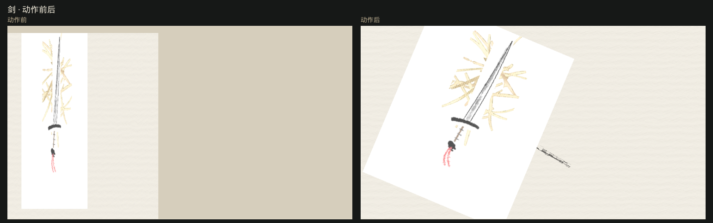
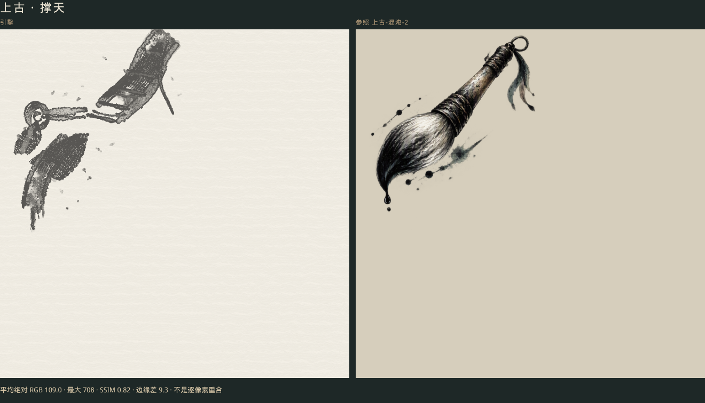

# 08 · 玩法与存档

[目录](./README.md) · [上一章](./07-ink-rendering.md) · [下一章](./09-tooling-and-quality.md)

**十卡舞台已经删掉。** 现在能玩的是切片页 `/scroll/`，能看的是叙事页 `/story/`、历史动画 `/history/`、参照画廊 `/gallery/`，以及二十个道具页 `/props/<id>/`。`defineGameplay(template, goal)` 把已知模板映成一个动词和一句「标签：目标」（未知模板仍保留目标原文）。叙事里的玩法节点用这句话当说明，点继续即完成，不跑对决。

画面上所有东西都由 [第 7 章](./07-ink-rendering.md) 的 inkEngine 笔刷一笔一笔画出来，笔刷取自一张表；刚体仍然是圆和矩形，只决定碰撞，不决定长相。

## 道具怎么画

`src/plugins/prop-brushes.ts` 的 `PROP_BRUSHES` 是唯一的笔刷表：每个道具（以及水面、远山、人物）按部件列出一行，内容就是在 inkEngine/index.html 面板上要选的东西，加上画师的手。

| 列 | 含义 |
|---|---|
| `mode` / `size` / `effect` / `blend` / `color` | 笔刷、尺寸、墨效、混色、颜色，取值见第 7 章 |
| `pressure` | 笔压 0..1，即含墨量。第 8 帧起 ≥ 0.3 升一档尺寸，≥ 0.5 两档，≥ 0.7 三档。省略表示鼠标 |
| `speed` | 每帧指针走多少像素。越快越细、越干，飞白越多 |
| `finish` | 可选。`flow` / `distort` / `metallic`，这一笔提交后跑。见第 7 章 |

湿、干、渗由这几列组合出来：`wet` / `effect4` 湿而洇，`flyingWhite` 加快速运笔是枯笔飞白，`mix` 是常规扩散。inkEngine 每笔都把内渗强度固定为 0.45，所以表里没有这一列。

`src/plugins/prop-paintings.ts` 只放路径：每个部件一条或几条手势（折线、二次或三次曲线、弧、波），`paintProp(id, { x, y, scale, mirror, pose, variant, width })` 按该部件的 `speed` 把路径采成每帧一个指针点（落笔和提笔时放慢），配上表里的笔刷和由道具、部件、序号算出的种子，返回 `PropStroke[]`。`scale < 1` 时笔刷尺寸换成按比例缩小的数值，手速同比放慢。`scale < 0.75` 时丢掉 `finish`：虫蚀和 flow 的半径是纸上的像素，缩小的手持件会被咬痕盖满。`actionStroke(id, part, path)` 画一笔动作（挥击、溅墨、尾迹）。

十个旧道具、`landscape` / `water` / `figure` 的笔刷仍在 `PROP_BRUSHES`。历史章节另有二十件，目录在 `HISTORY_PROPS`，画法走 `paintHistoryProp`：剑、刀、矛、盾、旗、马、水复用上表，其余在 `history-paintings.ts`，每件部件的笔刷不同。马是湿墨体积加飞白轮廓，旗面用 `wine_red` 多层湿笔（朱砂），不用会被洇成粉的 `red` 平涂。水在道具页上铺满 1600×900 的纸，不是一小块色块。

每件道具一页。逻辑舞台是 1600×900，画布 CSS 铺满内容区，绘图缓冲跟 `devicePixelRatio`（上限 2）。道具画在透明精灵上，近白的底被抠掉，落在纸上，并按笔画像素框居中。`?pose=still` 停在落笔后，`?play=1` 约七秒后做出动作。Matter 世界的 Y 向下。砍会拆掉木桩并留一笔飞白；落、走、流会解除刚体的静态，走和流在画面内停住；燃会喷出八点；风让旗在原位左右摇（这一版 Matter 没有单独的重力系数，步进后把高度钉回）。动作前后墨迹都留在画面里。场景编号写在页面上，来自 `video/docs/chapter-outline.md` 大纲，例如剑用于 `05-09 易水寒` 与 `07-01 鸿门宴`，水用于 `00-01 洪水` 与 `09-05 赤壁`。

## 参照画廊 `/gallery/`

五张 720×720 的 `InkSurface`。每张只有几十笔，来自 `assets/gallery/*.json`（`inkgames.vector-ink`，见 [第 5 章](./05-world-scene-and-assets.md)）：轮廓是一笔飞白，随笔压由细到粗再收到飞白；暗部是沿剪影的一块湿墨；另外几滴泼墨和朱砂。不画五官、发丝和衣纹排线。旁边的 `` 才是 `thirdparty/` 里的参照 PNG。页内差数把参照铺到纸色 `#d6cebc` 之后，报平均绝对 RGB（0–765）、16 像素窗 SSIM，以及亮度梯度差。这不是逐像素重合。SwiftShader 下的数字不能当成真实 GPU 验收。`?play=1` 会让湿墨再扩散几秒。`?build=chaos-2` 只铺撑天那支笔，一笔一笔出现。

无头 Chromium + SwiftShader（2026-10-09）。「程序摆件」是矢量稿之前的平均绝对 RGB。「矢量稿」是手写路径再经笔刷铺出来之后，同一套差数，外加 16 像素窗 SSIM（越高越像）和亮度梯度差（越低越像）。

| 画 | 程序摆件 | 矢量稿 | 矢量稿最大 | SSIM | 边缘差 |
|---|---:|---:|---:|---:|---:|
| 上古 · 留白 | 191.3 | 195.6 | 675 | 0.35 | 29.3 |
| 上古 · 撑天 | 107.0 | 110.5 | 707 | 0.84 | 8.3 |
| 上古 · 山水与人 | 115.4 | 131.3 | 695 | 0.64 | 16.9 |
| 上古 · 补天 | 162.6 | 161.6 | 691 | 0.52 | 18.1 |
| 楚汉 | 284.0 | 343.6 | 703 | 0.08 | 36.2 |

2026-10-09 改成减笔。每张几十笔轮廓和一块湿墨，不画五官和发丝。撑天是一支笔（竹管、两道缠绳、环与穗、湿毫和滴墨），不是人物。SSIM 0.84 里有大片空白纸，不能当成已经重合。留白是五个剪影（坐、立而举手、伸臂、崖上指天、船中），山水与人是两个人和山石，补天是裂开的两团天、一个举臂的人和几块彩石。楚汉平均差比密线那一版更大，从 263.4 到 343.6，因为画面留白多了；缩略图上仍是左侧披风、右侧人马、中景矛旗、浅河和朱砂。真实 GPU、Safari、Firefox 未实测。并排图在 [docs/images/gallery](./images/gallery/)。录屏在 [docs/videos](./videos/)，撑天的逐笔过程是 [gallery-build.webm](./videos/gallery-build.webm)。

## 切片页 `/scroll/`

单独一关：一条折线坡、地面洇墨、披麻与斧劈两块石头、两竿竹、一块单向平台和一座可洗的桥。页面自己开 `requestAnimationFrame` 调 `InkView.frame`，帧步长做了 `[0, 0.05]` 钳制（首帧的 rAF 时间戳可能早于捕获的 `performance.now()`，不夹会让 `Playfield` 收到负步长）。

键：A/D 或左右移动，W 或上跳，下加跳穿过单向平台，空格攻击，Q 在脚下洗桥并洗墨。`?pose=rest` 与 `?pose=cut` 把角色放到固定帧后停住，给截图用，不继续跑动画循环。

状态栏显示脚的受力、位置与最近竹竿是否断开，供无头冒烟与人工核对。

## 叙事页 `/story/`

`apps/story/` 只读导入 `video/data/examples/05-09-zhanguo-jingke.json`，不改这些数据文件。`parseScenePackage` 收成 `ScenePackage`。`StoryStage` 拥有自己的 `WebGLRenderer` 和一层一个 `InkSurface`。开场 `cutscene.zhanguo.jingke.opening` 按 60 帧时钟播五个镜头；标题、旁白由 `InkText` 画在画布纹理上。缺的配音和 BGM 文件不在仓库里，`AudioBus` 用短振荡器占位，旁白结束帧仍按这段时长放开同步点。

情节树：开场之后是选择。`pick.canon` 走上朝、柱、结局；`pick.legend` 走琴、逃、结局。缺过场定义的节点（野史琴）显示标签并等待继续。`pick.whatif` 要正史和野史都已通关才出现。玩法节点显示目标文字，例如「稳住秦舞阳」，点继续即完成，不跑对决。

存档键 `inkgames.save`，版本 1。进入节点时写入检查点（构造时不写，避免盖掉已有档）。`resume()` 回到检查点上的节点。时间线列出入口、出口和节点 id，当前节点加 `here`。`?pose=title` 停在开场前几十帧；`?pose=fork` 快进到选择；`?pose=canon` 再选正史。没有 `pose` 时按动画帧往下播。

## 历史动画页 `/history/`

`apps/history/` 用 `InkScene` 展示上古「混沌开卷」五幕：30 fps 展示、名义 90 秒、保留原剧本字幕，提供播放 / 暂停 / 重播 / 进度拖动 / 跳镜，`?frame=1200` 可定位审片帧。分件与关键帧数据在 `apps/history/chaos-data.ts`，求值在 `src/core/ink-presentation.ts`。开播前会核对每一层都已登记；页面卸载时先停掉刷新，再释放场景，避免对已清空的槽调用 `pose` 抛出「未知墨层 ink」。逻辑帧按墙钟追赶并携带进位（见 [第 3 章](./03-clocks.md)），实测 8.0 秒墙钟推进 8 帧秒。

历史动画页自己不加载参照图：无头冒烟仍断言 `/scroll/`、`/story/`、`/history/` 的图片请求数为 0。对照图只出现在 `/gallery/`。

## 录制（未实现）

2.0 的录制格式 `inkgames.ink-recording` 版本 2 **还没有**，v0.1 的 `recording.ts` 已随旧微内核删除，`StrokeCue` 的 `recording` 来源返回空笔画。

要复现一条 2.0 笔画，保存它的 `PropStroke`（笔刷、颜色、每帧的点、种子）再交给 `InkSurface.paint`。同一种子在 inkEngine 里对应 `p.randomSeed(seed)` 后的同一笔。`tests/ink-brush.test.ts` 锁的是笔触数据，不锁 GPU 图像。

轨道字段以 [内容数据格式](../video/docs/content-schema.md) 为准；开场管线与未完成项的优先级以 [video/docs/engine-gaps](../video/docs/engine-gaps.md#6-纯引擎水墨动画实现方案2026-10-09-重新评估) 为准；历史动画的逐项状态以 [动画计划 §15](../video/docs/production-plan.md) 为准。
