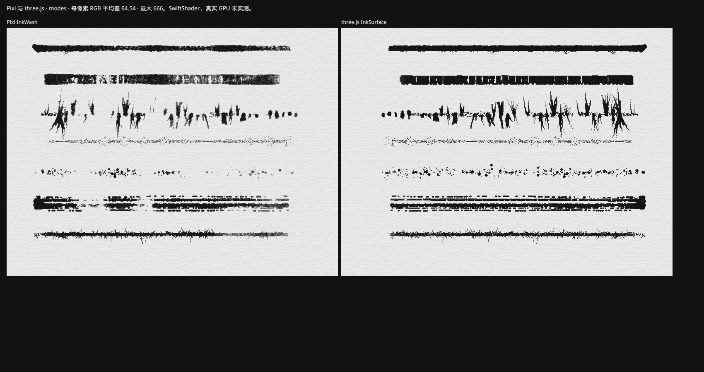

# 12 · 与 inkEngine 的效果对照

[目录](./README.md) · [水墨实现](./07-ink-rendering.md) · [引擎计划](../plan/10-three-matter-side-scroller-plan.md)

> **本章总表是历史记录。** 它审计的宿主 **Pixi `InkWash` 已删除**（2026-10-09），现行走 `InkSurface`（three.js 渲染目标）的同一套笔刷与反馈顺序。因此表中「证据」栏里以 Pixi 控件（`Graphics`、`Filter`）为参照的数值不再可复现，其余对 inkEngine 算法与随机顺序的结论仍然有效。文末「three.js 后端」是 `InkSurface` 的 SwiftShader 并排，不是逐像素一致，真实 GPU 未实测。

对照对象是 `thirdparty/inkEngine/`（`ink-engine.js`、`NAME-MAP.md`、`README.md`、`index.html`）。它是 inkField 的可读还原，回放录制时与原版逐像素一致。本仓库把它的笔刷与着色器移植进 `src/`，先在 Pixi 上跑，迁移后由 `InkSurface` 在 three.js 渲染目标上跑同一条管线；不把 `ink-engine.js` 嵌进页面，也不宣称逐像素相同。

书面授权由仓库所有者声明，授权书不在仓库内。移植的文件头写了归属：`src/core/ink-brush.ts`、`ink-random.ts`、`ink-palette.ts`、`ink-paper.ts`、`ink-shaders.ts`（由 `scripts/port-inkengine-shaders.mjs` 生成）、`ink-raster.ts`、`ink-pass.ts`、`ink-surface.ts`。已删除的 `ink-wash-filters.ts` / `ink-wash.ts` 曾承载同一批移植。`thirdparty/` 未改。

状态用词：

| 用词 | 含义 |
|---|---|
| 移植 | 逐行转写，随机抽取顺序和常数都保留 |
| 对齐 | 同一算法和数据流，实现方式换成 three.js（早期为 Pixi） |
| 不同 | 有意换成另一做法，原因写在证据栏 |
| 缺失 | `src/` 里没有对应路径 |

证据是读源码、单测，以及无头 Chromium + SwiftShader 的截图与像素统计。没有独立显卡实测，Safari / Firefox 未测。

## 总表

| 能力 | inkEngine | 状态 | `src` 里的证据 |
|---|---|---|---|
| 七种笔刷 | `drawBrushStroke`、`drawBranch`、`drawSprayDots`、`drawDryBrush`、`drawMarker`、`drawGothic`、`drawFlyBrush`，`BRANCH_OFFSETS_5/8/12`、`MARKER_LINES`、`buildFlyBranchConfig` | 移植 | `InkBrushEngine`。同一条测试笔画（`p.randomSeed(100)`，40 帧）两边的笔画种子都是 347340893；去掉 inkEngine 自己画的红色虚线路径后，大笔、marker、gothic、fly、brushSP 每帧的线段数逐帧相同，大笔第 6 帧的线段坐标与线宽差 ≤ 0.001px |
| 落笔参数 | `mousePressed` 按模式设 `initialSize`、`interpSteps`、`spring`、`friction`、`maxUpdates`，以及一串随机量 | 移植 | `press()`。被原版覆盖或丢弃的随机量（如 `indiffusionStrength` 先随机后固定为 0.45）照样抽取，保证后续数值对得上 |
| 每帧状态 | `draw()`：`inkGray`、墨量递减、笔压分档、笔尖偏移 −10px、哥特不偏移 | 移植 | `frame()` / `drawFrame()`。笔压梯度里的 `pow(·, 0.6)` 用牛顿法 `pow06` 代替 |
| 随机与噪声 | `crandom` → p5 `random`（LCG）与 `noise`（4 层倍频、余弦插值） | 移植 | `P5Random`、`P5Noise`。余弦用多项式，与 `Math.cos` 相差 < 1e-8（单测） |
| 线、点、矩形的光栅化 | p5 WEBGL，帧缓冲带 MSAA | 对齐 | 早期用 Pixi `Graphics`，现由 `ink-raster.ts` 画进带 MSAA 的 `stamp`，再叠到湿层。只看笔触、不跑 feedback 时，同一笔 10 帧后湿层平均灰度 239.5（inkEngine）对 239.4（src） |
| 扩散 | `runFeedbackPass` + `feedback.frag` 的 6 个墨效分支 | 移植 | `INK_FEEDBACK_FRAGMENT`。输出 alpha < 1 时按 p5 的 `(ONE, ONE_MINUS_SRC_ALPHA)` 叠在专用 ping-pong 上再叠回湿层；同一笔 10 帧后湿层平均灰度 241.8 对 239.8，逐像素平均差 2.6 级 |
| 倒计时与提交 | `maxUpdates` 帧力度递减，`commitStroke`：encode → typeMap → final | 移植 | `INK_ENCODE_FRAGMENT`、`INK_TYPE_MAP_FRAGMENT`。p5 把编码结果拷到不透明白底时 alpha 变成 1、颜色加上 `1 − alpha`，编码 pass 末尾照做 |
| 36 色与色相抖动 | `COLOR_PALETTE`、`hueShift` / `satShift` / `briShift`，明度 > 0.6 推到 0.95 | 移植 | `INK_PALETTE`，encode/realtime 原样 |
| 混色 | mix / multiply / darken / spectral（38 段反射率） | 移植 | 都在 encode 着色器里；道具表目前只用 mix |
| 合成 | `composite.frag`：纸 × 墨，白墨走滤色 | 移植 | `INK_COMPOSITE_FRAGMENT` |
| 实时湿墨 | `realtime.frag` | 移植 | 拖动时 `update()` 用它叠出未提交的湿墨 |
| 纸 | `generatePaperTexture(40, 20, 15, 0.2)`，P2D 拼贴后乘到底色 ×1.1 | 移植 | `inkPaperPixels`，同样的 Canvas 2D 调用和种子 |
| 力场 | `updateForceMap` 每帧跑 `mapFrag`，时间来自 `millis()` | 对齐 | 每次 feedback 前按 `frameCount / 60` 重画当前笔画矩形（`clock: 'frame'` 的 `millis()*0.001`）。时钟从 2 起，对齐宿主页 `ready` 之后的 `step(2)`。空闲时不重画整幅。原版从未上传的 6 个 uniform 仍为 0 |
| 全屏 pass | 每帧对整个画布跑 feedback | 不同 | 只跑笔画外接矩形。墨效 0–3 下矩形外像素原版也不变；墨效 4/5 的外扩按每帧 3px 预留 |
| 重叠处的残影 | 新笔第一帧与上一笔的 ping-pong 内容混合 | 移植 | 落笔不再把上一笔的矩形填白。feedback 的 alpha < 1，重叠处叠在残留的 ping-pong 上 |
| 镜头与分层 | EasyCam、4 层 z、景深模糊 | 对齐 | `inkLayerScale`：`fov = π/3`，距离 `height / (2·tan(30°))`，`tan(30°) = 1/√3`。z = 0 的纸层不缩放，指针加回相机偏移。远山 z = −80，人物和道具 z = 40 并绕落点缩放。相机以 0.05 跟手，最多偏 48×36 px。没有 EasyCam 的 1.1 倍变焦，也没有景深模糊。对照页 `?scene=camera` 把整幅画放在 z = 40，对应 inkEngine 的 `finalOut` |
| flow | `flow.frag`，按住时 `blendVol * (1 + iterations·0.1)`，松手写入 final / typeMap | 对齐 | `InkFinish.flow`。稳定画面是松手后再合成的那一帧（`composite(flow(final))`），不是按住期间那一帧。种子用笔画种子而不是 `Math.random()`。`strokeBounds` 仍是左上角归一化坐标，和原版一样拿去跟左下角的 UV 比 |
| distort | `distort.frag`，默认关；打开后扭曲整幅 | 对齐 | 着色器移植。`displacementB = 20`、`displacementC = 50`（面板值）。对照页 `extent: 'frame'` 跑整幅。道具表里的水面深处只扭曲该笔的矩形，避免把远山一起拉开。rs / cellular / 白点 / 颗粒没有接上 |
| metallic | `scanBugBites` + `metallic.frag` | 对齐 | 阈值、加权抽样、闪电形轮廓和「偏移乘 0」都在。`bugsSize` 与 tint `[0.72, 0.5, 0.35]` 走面板默认。像素和 inkEngine 差几级时，最暗的采样点会换地方，咬痕中心跟着换。没有 boid。提交之后不会每帧对整幅重跑 |
| 遮罩 | `drawMaskRect` / `drawMaskPolygon` | 缺失 | 合成之后没有遮罩 pass |
| 录制 | `mp` / `md` / `mr`、回放 | 不同 | `src/plugins/recording.ts` 只记录 v0.1 命令。2.0 的笔画用 `PropStroke`（笔刷、颜色、每帧指针点、种子）表达，对照页把它交给宿主页重画 |
| 旧流体 | 无 | 不同 | `src/plugins/ink-fluid.ts` 仍服务 `/inkcross/`，不是这条管线 |

## 道具怎么画

每个道具是一组指针笔画，笔刷取自 `src/plugins/prop-brushes.ts` 的 `PROP_BRUSHES`，路径在 `src/plugins/prop-paintings.ts`，见 [第 8 章](./08-gameplay-and-persistence.md)。对照页 `/compare/?prop=<id>` 用公共 API 画一个道具，并把笔画按 inkEngine API 导出（模式编号、尺寸、墨效、混色、颜色、指针坐标、种子）。`scripts/capture-parity.mjs` 让宿主页逐笔执行 `p.randomSeed(seed)`、`setBrush`、`setColor`、`strokePath`、`step`，两边同尺寸、同纸色、同纸纹种子，再并排截图。

## 并排时应该看到什么，以及不该声称什么

同一组笔画下，两边的每一笔应落在同一位置，有同样的笔势、分叉、飞白断口、点画分布和颜色。力场现在按帧时钟重画，重叠处也不再被填白。剩下的出入来自线段光栅化（原 Pixi `Graphics`，现 `ink-raster.ts`）与 p5 的实现差异、MSAA，以及着色器噪声的取样。所以墨色深浅和斑驳的位置仍会有几级灰度的差别，构图和笔性应当一致。

flow、distort、metallic 各有一张对照页（`/compare/?scene=flow|distort|metallic`），分层镜头是 `/compare/?scene=camera`（整幅在 z = 40）。剑刃、刀身、枪头在道具表里打开 metallic，水面打开 flow，水面深处打开只作用于该笔矩形的 distort。游戏页的纸层保持 1:1，人物和手持物在 z = 40 放大，远山在 z = −80 缩小并少跟一点相机。

未实测：独立显卡、Safari、Firefox、以及「和 inkField 原版逐像素一致」。SwiftShader 截图只说明着色器能跑、构图和笔性可对。

## three.js 后端

这次并排用的页面是 `/compare/parity.html?scene=modes` 与 `apps/compare/strokes.ts` 里的同一组笔画，**两侧都已随 Pixi 清理删除，当前不可重新运行**。左边当时是 Pixi `InkWash`，右边是 three.js `InkSurface`。尺寸 800×600，种子 `1234567890`，底色 222 灰，`pixelRatio` 为 1。差值是每个像素 R、G、B 绝对差之和（单通道 0–255，三项相加 0–765），再对全部像素取平均。以下是当时记录的数字，保留作历史，不代表现行可复现结果。

无头 Chromium + SwiftShader 这一次：平均 **64.54**（精确值 64.53543125），最大 **666**，GL 错误 0。七种笔刷的位置和笔势在并排里对得上。这个数字不是逐像素一致，也不能写成已经对齐 inkEngine 或真实 GPU。Pixi 与 three.js 的线段光栅化、MSAA 和色彩空间不一样，纸纹和笔缘会差出几十级。Safari、Firefox、独立显卡未实测。

`scripts/gpu-check.mjs --shots` 不再打开已删除的 `/compare/`。它截切片、叙事、历史动画，以及 `/props/<id>/?pose=still` 和 `/gallery/`。SwiftShader，真实 GPU 未实测。

剑、刀、矛、盾、旗、马、水这七件在道具页上导出与 `InkSurface` 相同的笔画，再用 `scripts/inkengine-host.html` 重放。左边是道具页舞台（含纸、地面、木桩），右边是同一组笔画在 inkEngine 纸上的结果。没有再算一个平均差：两边画布尺寸不同，不适合写成一个数。SwiftShader，不是逐像素重合。并排在 [docs/images/props](./images/props/)，例如 [剑](./images/props/prop-sword-ink.png)、[水](./images/props/prop-water-ink.png)。Safari、Firefox、独立显卡未实测。
