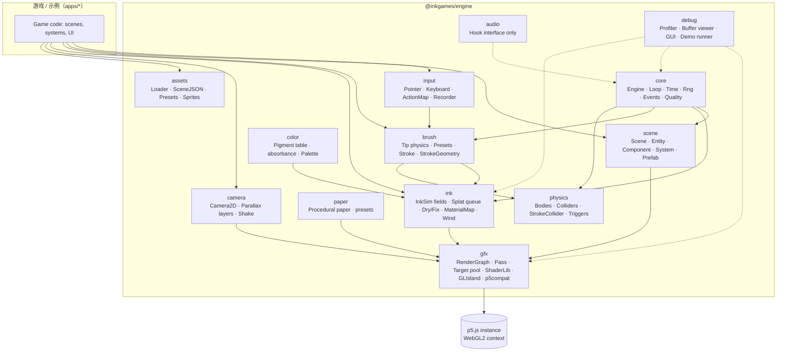
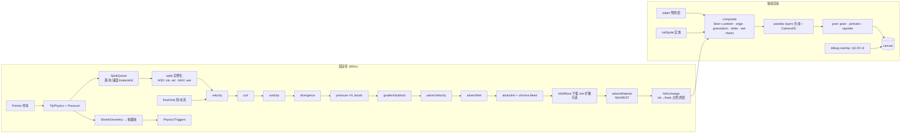

# 04 · 架构设计（InkGames v1）

## 1. 设计原则

1. **引擎是库，不是 app**：`@inkgames/engine` 不碰 DOM（canvas 和 pointer 事件除外），没有全局变量，可以在一个页面里创建多个实例（多实例共享 p5 实例时，共用一个 GL context）。
2. **固定步长、可重放**：逻辑、物理、墨水模拟都以 `FIXED_DT = 1/60` 推进；渲染插值。所有随机数来自命名的 PRNG 流。（吸取 inkField "每帧一步"的教训，01 §14.2）
3. **场模型来自 inkwash，笔触与质感来自 inkField 的思想**：GPU 上的 wet / ink / fixed / velocity 多场 + 吸收度颜料；笔刷是参数化的"笔尖物理 + 鬃毛遮罩 + 实例化 splat"。
4. **身份和颜色分离**：MaterialMap 独立存放、独立平流（最近邻），绝不把元数据塞进颜色通道（01 §5.4 的 purple ghost 教训）。
5. **游戏判定走 CPU 几何**：笔画在 CPU 上生成确定的折线/胶囊链，用来碰撞；GPU 场只用于视觉和可选的低分辨率异步查询。
6. **p5 优先，必要时进入 GL island**：能用 p5 `createFramebuffer/createShader/shader()/rect()` 做的用 p5；MAX 混合、scissor、实例化等用 `drawingContext`（WebGL2）在封装好的 `GLIsland.run(fn)` 里做，结束时恢复 p5 期望的状态。
7. **质量档驱动分辨率**：所有 pass 的分辨率、迭代次数都从 `QualityProfile` 读，运行时可以自动降档。

## 2. 技术选型

| 项目 | 选择 | 理由 / 备注 |
|---|---|---|
| p5.js | **2.3.x**（截至 2026-10 最新 v2.3.1，2026-07-21 发布），instance mode，npm 依赖、不修改 | 2.x 默认 WebGL2，`createFramebuffer` 支持 `format: FLOAT/HALF_FLOAT`、`textureFiltering`；M0 spike 验证。**回退方案**：1.11.x（inkField 用的 1.11.10），API 差异用适配层 `gfx/p5compat.ts` 隔离 |
| 语言 | TypeScript 5.x strict，ES modules | 引擎公共 API 要有类型；示例/用户代码可以是 JS |
| 构建 | Vite 6+（lib mode 输出 ESM + d.ts）；GLSL 用 `?raw` 导入 + 小型 `#include` 预处理插件 | 不混淆 uniform 名（01 §14.4） |
| 包管理 | pnpm workspaces | engine / apps / tools 分包 |
| 测试 | Vitest（纯逻辑：PRNG、笔刷几何、ECS、序列化、碰撞）；Playwright（Chromium + WebKit）跑 `?demo` 脚本截图对比（参考 inkwash 898–977） | 无头 GPU：CI 用 SwiftShader/软件渲染，容差放宽；真机测试手动执行 |
| 代码风格 | ESLint + Prettier；GLSL 用 `glslangValidator` 做语法检查（CI） | |
| UI 调试 | lil-gui（MIT） | 只用在 debug 包，不进核心 |
| 物理 | v1 自研轻量 2D（圆 / AABB / 胶囊链） | 体积小、确定性可控；v2 再评估 planck.js 等 |
| 光谱混色 | v2：spectral.js（MIT） | 01 §5.2 |

## 3. 模块总览



### 3.1 core
- `Engine`：持有 p5 实例、`RenderGraph`、各个子系统；生命周期 `create → load → start → pause/resume → dispose`。
- `Loop`：累加器式固定步长。`acc += min(frameDt, 0.1); while (acc >= FIXED_DT && steps < MAX_STEPS(=2)) { fixedUpdate(); acc -= FIXED_DT }`，然后 `render(alpha = acc / FIXED_DT)`。卡顿时丢掉多余步数（记入调试统计），避免死亡螺旋。墨水模拟默认每个固定步跑一次；低质量档可以设成每 2 步一次（`inkSimEvery`）。
- `Rng`：Mulberry32/PCG32 实现的**命名流**：`rng.stream('brush')`、`'ink'`、`'game'`、`'fx'`，每个流由 `hash(worldSeed, name)` 派生，每笔再由 `hash(streamSeed, strokeIndex)` 派生。好处：一个子系统多调用一次 random，不会破坏其他子系统的序列（解决 inkField 需要 Crandom 计数排查的问题）。**禁止**在引擎里用 `Math.random()` 和 p5 全局 `random()`。
- `Events`：类型化的事件总线（`mitt` 风格，自研 50 行）。
- `Quality`：`QualityProfile` 档位与自动降档（滑动窗口内 GPU 帧时间 > 预算 × 1.2 时，连续 N 秒就降一档）。

### 3.2 gfx（渲染图）
- `RenderTarget`：封装 `p5.Framebuffer`（或 island 里的原生 FBO），带 `format`（`RGBA8 | RGBA16F | RG16F | R16F`）、`filter`、`double`（ping-pong 用**交换引用**，不拷贝；对比 inkField 2083–2119 的"写完拷回"）。
- `TargetPool`：按 (尺寸, 格式) 复用临时目标；resize 时用 copy pass 重采样（inkwash 566–578）。
- `Pass`：`{ name, shader, inputs, output, uniforms(ctx), blend?, scissor?, enabled(ctx) }`，执行时自动绑定全屏三角形。
- `RenderGraph`：按帧声明 pass 列表，支持 `dirty` 跳过（inkField `_j575` 思想），每个 pass 带 GPU 计时（`EXT_disjoint_timer_query_webgl2`，没有这个扩展时只统计 CPU 时间）。
- `ShaderLib`：GLSL 源码模块（`common/noise.glsl`、`common/fullscreen.vert`……），预处理 `#include`；uniform 缓存，值没变就不上传（inkField `_j28` 思想）。
- `GLIsland`：`run(gl => {...})`，进入前记录、退出时恢复 blend / scissor / viewport / bound FBO / program，给 p5 2.x 状态管理留出余地。
- `p5compat`：抹平 p5 1.x/2.x 在 framebuffer 选项、`shader.setUniform`、`drawingContext` 上的差异。

### 3.3 ink（墨水模拟，内核由 inkwash 移植）
- 场：`velocity(RG16F,double)`、`divergence(R16F)`、`curl(R16F)`、`pressure(R16F,double)`、`wet(R16F,double)` 位于 **sim 分辨率**；`ink(RGBA16F,double)`、`fixed(RGBA16F,double)`、`material(RGBA8,double, NEAREST)` 位于 **dye 分辨率**。
- `InkSim.step(dt)`：顺序与 inkwash `step()`（789–882）一致，另外插入：①风场力（`flowField` pass，加到 velocity）；②可选干笔扩散（`inkDiffuse` pass，只在笔刷 mask 区域、只在 `wet` 低的区域生效）；③material 平流（与 ink 同一个速度场，最近邻采样，并按"颜料覆盖强度"决定是否被新墨的身份覆盖）。
- `SplatQueue`：笔刷每个固定步提交一批 splat（位置、半径、墨量 RGBA、水量、速度、鬃毛遮罩参数、materialId），由 `splat` pass **实例化**一次画完（inkwash 是逐个 drawArrays + scissor；实例化是 InkGames 的优化）。
- `fix(region?)` / `clear(region?)` / `dryAll()`；`sample(x, y)` 异步读回（PBO + fence，低分辨率，结果晚 1–2 帧，**只用于表现**）。
- 参数 `InkSimConfig`：flow、bleed、dry、chroma、vorticity、pressureIters、dissipation、inkStrength、edge、grain……（对应 inkwash `P` 与 884–896 的渲染常数）。

### 3.4 brush（笔刷与笔画）
- `TipPhysics`：两种模型
  - `spring`（inkField 思想，改成与 dt 无关）：`a += (target - pos) * k·dt·60; a *= damping^(dt·60); pos += a`，速度 → 宽度 `w = size·(1 − clamp(speed·thinning))`；
  - `exp`（inkwash）：`pos += (target − pos)·(1 − exp(−λ·dt))`，λ 默认 14。
- `PressureModel`：真实压感（中值滤波 3 点 + 曲线），或者速度模拟 `p = clamp(a − b·speed, pmin, 1)`。
- `BristleMask`：每个笔刷有 N 根"鬃毛"（v1 用 1D 噪声纹理沿笔宽方向采样），墨量低或速度快时阈值提高 → 出现飞白断丝（替代 inkField 的 CPU 分叉线表，01 §6.2）。
- `InkLoad`：笔上墨量与水量，随距离消耗（inkField `size -= randStep` 的思想），影响浓淡和飞白程度；"蘸墨"操作重新加满。
- `BrushPreset`：数据驱动（JSON），见 §5。
- `Stroke`：`points: StrokePoint[]`、`bounds`、`length`、`inkUsed`、`presetId`、`seed`；`StrokeGeometry.toCapsules(tolerance)`：RDP 简化 + 按宽度生成胶囊链，交给 physics。
- 起收笔：`taperIn/taperOut`（距离或时间）、`explode`（散墨概率，inkField 思想）。

### 3.5 color / paper
- `Pigment`：`{ id, name, absorbance: [r,g,b], white?: number, granulation, staining }`。v1 内置：焦墨/浓墨（≈inkwash `INK_ABS [1,0.97,0.88]` 的加强版）、淡墨、花青、赭石、藤黄、朱砂、胡粉（白）。数值由选色器公式 `A = −log(max(v, .02))` 换算后人工调整（标为**待调参**）。
- `Palette`：游戏可以限制可用颜料。
- `Paper`：程序化生成（低频纤维 fbm + 高频纸齿 + 帘纹），参数 `tone, fiber, tooth, absorbency, sizing`（生宣 / 熟宣 / 绢）。`absorbency` 会调制 wet 扩散速度和边缘强度——这是 inkField 和 inkwash 都没有、InkGames 新增的"纸性"参数。

### 3.6 scene / physics / camera
- 轻量 ECS：`Entity`（id + component map）、`Component`（纯数据）、`System`（`fixedUpdate(world, dt)` / `render(world, alpha)`）。不追求极致性能，v1 目标是 ≤ 2000 个实体。
- 内置组件：`Transform`、`InkSprite`（以墨的方式渲染位图/轮廓）、`Body`（velocity, mass）、`Collider`（circle / aabb / capsuleChain）、`StrokeLink`（实体由笔画生成）、`Trigger`、`InkEmitter`（持续往场里滴墨/水）、`FieldProbe`（采样风场 / 速度场，对实体施力，例如锦鲤被水流推动）、`Parallax`（所在视差层）。
- 内置系统：`PhysicsSystem`、`StrokeColliderSystem`（strokeEnd → 生成刚体）、`InkEmitterSystem`、`FieldForceSystem`、`SpriteRenderSystem`。
- `Camera2D`：position、zoom、follow(target, lerp)、bounds、shake；`ParallaxLayers`：每层一个 factor（0 = 远山不动，1 = 跟世界），渲染时用不同的平移量合成（inkField z-planes 的 2D 化）。v1 墨水场 = 一个"画布世界"（默认就是屏幕大小，可以大于屏幕，相机在里面移动）。

### 3.7 input
- `PointerHub`：Pointer Events 统一（mouse/touch/pen），`pressure`、`tiltX/Y`、`buttons`（侧键 `buttons & 34`，参考 inkwash）、`webkitmouseforcechanged`；可配置"笔画墨、手指画水 / 平移"。
- 输入会被**量化到固定步**：每个固定步消费该步之内的所有 pointer 样本（保留子步时间戳供笔刷插值），录制时也按"步号 + 样本"记录，回放天然对齐（对比 inkField "每帧最多一个 md"的限制）。
- `ActionMap`：键盘/手柄动作绑定。

### 3.8 assets / 序列化
- `SceneDef` JSON（见 §5.3）、`BrushPreset` JSON、`PaperPreset` JSON、`PigmentTable` JSON；`Loader` 基于 fetch + 缓存，支持 Vite 静态资源导入。
- `Recording`：`{ format: "inkgames.rec", version: 1, engineVersion, seed, quality, scene, presetsHash, steps: [[stepIndex, kind, ...payload]] }`，点数据用增量编码 + 定点数（比 inkField 每个 mp 带约 40 字段快照紧凑得多）。
- 可选（v2）：`importers/inkfield-recording.ts`，只读取用户自己的 inkField 录制里的**坐标和压力**，转成 InkGames 的笔画（不复现 inkField 的算法），并提示用户注意录制作品的版权归原作者。

### 3.9 audio（钩子）
- `engine.audio.on('strokeSpeed' | 'inkSplat' | 'dry' | 'collision', cb)`，传出归一化参数，由游戏自己接 Web Audio / Tone.js。

### 3.10 debug
- `Profiler`（每个 pass 的 GPU/CPU 时间、帧时间直方图，移植 inkField 性能监视器"自动给出建议"的思路）。
- `BufferViewer`：选择场 → 伪彩色画到角落（velocity 用 HSV 表示方向、pressure 用红蓝、wet 用灰度、material 用调色板）。
- `DemoRunner`：`?demo=<script>` 用固定输入脚本、固定 seed 跑 N 步，`readPixels` 计算哈希/统计并 `console.log`（inkwash 898–977 模式），给 Playwright 用。

## 4. 渲染管线（每个固定步 + 每帧）



说明：
- `paper` 在加载或 resize 时烘焙一次（inkField `_j9` 一次性生成纸纹的思想），通常不进每帧。
- `composite` 只在 ink/fixed 有变化或相机移动时运行（dirty）；静止画面不重新合成。
- 视差层：远景层（远山、云）可以是**预烘焙的静态墨画**（离线跑模拟后存成 RGBA16F 或 8-bit 纹理），近景层是实时模拟场；v1 只有一层实时模拟。

## 5. 公共 API 草图（TypeScript）

```ts
// ===== 创建与配置 =====
export interface EngineConfig {
  parent: HTMLElement | string;
  width: number; height: number;          // CSS 像素
  quality?: 'auto' | 'low' | 'medium' | 'high';
  seed?: number;                          // worldSeed
  fixedHz?: number;                       // 默认 60
  p5?: p5;                                // 可传入已有实例（共享 context）
  paper?: PaperPresetId | PaperDef;
  ink?: Partial<InkSimConfig>;
  debug?: boolean | DebugConfig;
}

export interface QualityProfile {
  name: 'low' | 'medium' | 'high';
  maxDpr: number;            // 1 / 1.5 / 2
  dyeBase: number;           // 512 / 1024 / 2048（短边）
  simBase: number;           // 128 / 256 / 256
  pressureIters: number;     // 12 / 18 / 22
  inkSimEvery: 1 | 2;
  post: { grain: boolean; pinholes: boolean };
  floatFormat: 'RGBA16F' | 'RGBA8_PACKED';   // 降级路径
}

export interface InkSimConfig {
  flow: number; bleed: number; dry: number; chroma: number;  // 0..1, 对应 inkwash P
  vorticity: number; dissipation: number; pressureIters: number;
  inkStrength: number; edge: number; grain: number;          // 显示
  diffuse: { enabled: boolean; strength: number; edgeDeposit: number }; // 干笔扩散
}

export class InkEngine {
  static create(cfg: EngineConfig): Promise<InkEngine>;
  readonly time: TimeInfo;            // step, alpha, fps
  readonly rng: RngRegistry;
  readonly events: EventBus<EngineEvents>;
  readonly input: InputSystem;
  readonly brushes: BrushRegistry;
  readonly pigments: PigmentRegistry;
  readonly ink: InkSimAPI;
  readonly world: World;              // ECS
  readonly camera: Camera2D;
  readonly assets: AssetLoader;
  readonly debug: DebugAPI;
  loadScene(def: SceneDef | string): Promise<Scene>;
  start(): void; pause(): void; resume(): void; dispose(): void;
  record(): Recorder; replay(rec: Recording, opts?: { speed?: number }): Replay;
}

// ===== 墨水 =====
export interface InkSimAPI {
  splat(s: SplatDef): void;                    // 低层：直接投墨/水/力
  stroke(points: StrokePoint[], preset: BrushPresetId, pigment?: PigmentId): Stroke; // 程序化笔画
  fix(region?: Rect): void; dryAll(): void; clear(region?: Rect): void;
  setWind(field: WindFieldDef | null): void;
  sample(x: number, y: number): Promise<InkSample>;  // 异步、低分辨率、仅表现用
  bake(): Promise<ImageBitmap>;                       // 导出当前画面
}
export interface SplatDef {
  x: number; y: number; radius: number;
  ink?: [number, number, number, number];       // 吸收度 RGB + 白
  water?: number; force?: [number, number];
  materialId?: number; bristle?: BristleParams;
}

// ===== 笔刷与笔画 =====
export interface StrokePoint { x: number; y: number; p: number; t: number; tiltX?: number; tiltY?: number }
export interface BrushPreset {
  id: string; name: string;
  tip: { model: 'spring'; stiffness: number; damping: number } | { model: 'exp'; lambda: number };
  size: { base: number; min: number; max: number; speedThinning: number; pressureCurve: [number, number] };
  load: { ink: number; water: number; consumption: number; redipOnPress: boolean };
  bristle: { count: number; noise: number; dryBreakup: number };  // 飞白
  taper: { inLen: number; outLen: number; explodeChance: number };
  deposit: { inkPerSplat: number; waterPerSplat: number; force: number; spacing: number };
  diffuse?: { enabled: boolean };              // 干笔 min 扩散
  collider?: { kind: 'capsuleChain' | 'none'; widthScale: number; solidifyAfter: 'release' | 'dry' };
}
export interface Stroke {
  id: number; presetId: string; pigmentId: string; seed: number;
  points: StrokePoint[]; bounds: Rect; length: number; inkUsed: number;
  state: 'drawing' | 'wet' | 'dry';
}

// ===== 场景 / 实体 =====
export interface SceneDef {
  format: 'inkgames.scene'; version: 1;
  world: { width: number; height: number; gravity?: [number, number] };
  paper?: PaperPresetId | PaperDef;
  palette?: PigmentId[]; brushes?: BrushPresetId[];
  inkBudget?: number;
  layers?: { id: string; parallax: number; bake?: string /* 预烘焙纹理 */ }[];
  wind?: WindFieldDef;
  prestrokes?: { preset: BrushPresetId; pigment: PigmentId; points: [number, number, number][] }[]; // 关卡里预先画好的墨
  entities: EntityDef[];
}
export interface EntityDef { id?: string; prefab?: string; components: Record<string, unknown> }
export interface Component { readonly type: string }
export interface System {
  readonly name: string; readonly order: number;
  init?(world: World): void;
  fixedUpdate?(world: World, dt: number): void;
  render?(world: World, alpha: number, g: RenderContext): void;
}
export interface Camera2D {
  x: number; y: number; zoom: number;
  follow(target: Entity | null, lerp?: number): void;
  shake(amp: number, dur: number): void;
  worldToScreen(p: Vec2): Vec2; screenToWorld(p: Vec2): Vec2;
}
export interface RenderPass {
  name: string; shader: ShaderId; output: TargetId; inputs: Record<string, TargetId>;
  uniforms?(ctx: PassContext): Record<string, UniformValue>;
  blend?: 'none' | 'add' | 'max' | 'alpha'; scissor?: Rect; enabled?(ctx: PassContext): boolean;
}

// ===== 事件 =====
export interface EngineEvents {
  strokeStart: Stroke; strokeEnd: Stroke; strokeDry: Stroke;
  collision: { a: Entity; b: Entity | Stroke; normal: Vec2 };
  trigger: { trigger: Entity; other: Entity; enter: boolean };
  sceneLoaded: Scene; qualityChanged: QualityProfile;
}
```

使用示例：

```ts
import p5 from 'p5';
import { InkEngine, presets } from '@inkgames/engine';

const engine = await InkEngine.create({ parent: '#app', width: 960, height: 640, seed: 42, quality: 'auto' });
engine.brushes.register(presets.wetBrush, presets.dryBrush, presets.finePen, presets.waterBrush);
engine.input.bindPointer({ pen: 'ink', touch: 'ink', mouse: 'ink', barrel: 'water' });
engine.events.on('strokeEnd', s => console.log('stroke', s.length, s.inkUsed));
await engine.loadScene('/scenes/inkcross-01.json');
engine.start();
```

## 6. 目录结构（`/Volumes/my/github/InkGames`）

当前只有 `plan/` 和 `thirdparty/`（`thirdparty/` 的内容本计划没有核实）。建议的结构：

```
InkGames/
├── plan/                         # 本计划文档（README + 01..05）
├── thirdparty/                   # 第三方参考源码的只读快照（不参与构建）
│   ├── inkwash/                  # MIT —— 移植来源，保留 licence.txt
│   └── README.md                 # 说明：inkField 不得放在这里作为可构建代码；如存在仅供本地阅读
├── packages/
│   └── engine/                   # @inkgames/engine
│       ├── src/
│       │   ├── index.ts
│       │   ├── core/             # engine.ts loop.ts time.ts rng.ts events.ts quality.ts
│       │   ├── gfx/              # render-graph.ts target.ts pass.ts shader-lib.ts gl-island.ts p5compat.ts
│       │   │   └── shaders/      # *.glsl（见 §7），common/{fullscreen.vert,noise.glsl,color.glsl}
│       │   ├── ink/              # ink-sim.ts splat-queue.ts material-map.ts wind.ts readback.ts
│       │   ├── brush/            # tip-physics.ts pressure.ts bristle.ts stroke.ts geometry.ts presets/*.json
│       │   ├── color/            # pigment.ts palette.ts pigments.json
│       │   ├── paper/            # paper.ts presets.json
│       │   ├── scene/            # world.ts entity.ts components/*.ts systems/*.ts prefab.ts scene-def.ts
│       │   ├── physics/          # bodies.ts colliders.ts broadphase.ts stroke-collider.ts
│       │   ├── camera/           # camera2d.ts parallax.ts
│       │   ├── input/            # pointer-hub.ts keyboard.ts action-map.ts recorder.ts replay.ts
│       │   ├── assets/           # loader.ts schemas.ts
│       │   ├── audio/            # hooks.ts
│       │   └── debug/            # profiler.ts buffer-viewer.ts gui.ts demo-runner.ts
│       ├── test/                 # vitest
│       ├── package.json  tsconfig.json  vite.config.ts
├── apps/
│   ├── sandbox/                  # 绘画沙盒：所有笔刷/颜料/纸张 + 录制回放 + buffer 查看器
│   ├── demo-inkcross/            # 示范游戏《墨渡》
│   └── samples/
│       ├── koi-pond/             # 水刷推动锦鲤（FieldProbe）
│       └── mountain-mist/        # 预烘焙视差远山 + 实时近景（不使用 inkField 的同名录制）
├── assets/                       # 纸张、印章、字体（注明许可）
├── tools/
│   ├── bake-layer/               # 离线跑模拟 → 导出视差层纹理
│   └── glsl-check/               # CI 用的 GLSL 校验脚本
├── e2e/                          # Playwright：?demo 截图基准
├── docs/                         # 使用文档（VitePress，v1 后期）
├── package.json  pnpm-workspace.yaml  tsconfig.base.json  vitest.workspace.ts  playwright.config.ts
├── LICENSE                       # 建议 MIT
└── THIRD_PARTY_NOTICES.md        # inkwash MIT 全文、p5.js LGPL-2.1 说明、lil-gui MIT、simplex-noise 来源等
```

## 7. v1 Shader 清单与来源

| # | 文件 | 作用 | 来源 | 许可处理 |
|---|---|---|---|---|
| 1 | `common/fullscreen.vert` | 全屏大三角形 | inkwash 228–271 | MIT 移植 |
| 2 | `splat.frag` (+`splat.vert` 实例化) | 高斯墨/水/力 splat + 鬃毛遮罩 + materialId | inkwash `splatFS` 313 + **新增**鬃毛（inkField 飞白思想） | MIT 移植 + 自研 |
| 3 | `advectVelocity.frag` | 半拉格朗日 + 湿度 mask | inkwash `advectVelFS` 323 | MIT |
| 4 | `curl.frag` | 涡量 | inkwash 416 | MIT |
| 5 | `vorticity.frag` | 涡量约束 | inkwash 427 | MIT |
| 6 | `divergence.frag` | 散度 | inkwash 381 | MIT |
| 7 | `pressure.frag` | Jacobi 迭代 | inkwash 392 | MIT |
| 8 | `gradientSubtract.frag` | 投影 | inkwash 404 | MIT |
| 9 | `advectWet.frag` | 湿度平流 / 扩散 / 蒸发，+纸 absorbency 调制 | inkwash 337 + 新增纸性 | MIT + 自研 |
| 10 | `advectInk.frag` | 颜料平流 + chroma bleed | inkwash 353 | MIT |
| 11 | `fixExchange.frag` | 活动→固定、白色烘焙 | inkwash `exchangeFS` 446 | MIT |
| 12 | `inkDiffuse.frag` | 干笔局部 min 扩散 + 边缘沉积 | **inkField 思想**（01 §5.1），独立实现 | 自研，不参考其 GLSL 文本 |
| 13 | `flowField.frag` | 程序化风/水流（simplex 向量噪声 + 涡旋） | **inkField mapFrag 思想**；simplex 用公开 MIT 实现（Ashima/stegu webgl-noise） | 自研 + MIT |
| 14 | `advectMaterial.frag` | 身份图平流（NEAREST）+ 覆盖规则 | **inkField typeMap 思想** | 自研 |
| 15 | `paper.frag` | 纸纹烘焙（纤维、纸齿、帘纹） | inkwash `displayFS` 纸部分 + 自研 | MIT + 自研 |
| 16 | `composite.frag` | Beer–Lambert + edge + granulation + 白 + 湿光泽 | inkwash `displayFS` 481 | MIT 移植并扩展 |
| 17 | `inkSprite.frag` | 实体以墨的方式渲染（距离场 → 浓淡 + 晕边） | 新增 | 自研 |
| 18 | `post.frag` | 颗粒、针孔白点、暗角、（可选）水波纹扰动 | inkField distort 的 grain/whiteDot **思想** + inkwash vignette | 自研 + MIT |
| 19 | `copy.frag` | 拷贝 / 重采样 / 烘焙 | inkwash `copyFS` 307 | MIT |
| 20 | `reduce.frag` | 降采样统计（墨覆盖率、平均湿度），给游戏逻辑和测试用 | 新增 | 自研 |

v2 候选：spectral 混色（spectral.js）、flow 位移后处理（8 种 blendType 思想）、cellular/resonance 等 distort 效果、金属/金粉、遮罩笔刷、3D/easycam 视差、分块流式场、WebGPU 后端。

## 8. 确定性策略

| 层 | 措施 | 能保证什么 |
|---|---|---|
| 输入 | 样本量化到固定步，记录 `(step, samples)` | 回放时输入序列完全相同 |
| 随机 | 命名 PRNG 流 + 每笔派生 seed，禁止 `Math.random` | 子系统之间互不干扰（inkField Crandom 问题的根治） |
| 笔刷几何 / 物理 | 纯 CPU、固定 dt，浮点运算顺序固定 | **跨设备一致**（同一 JS 引擎通常可以位级一致；不同引擎上标为"高度一致"） |
| 墨水场 | 固定 dt、固定迭代次数、同一质量档 | 同设备、同档位一致；跨 GPU 只保证视觉相似 |
| GPU 读回 | 结果**录进**录制（inkField 录 `targetPoints` 的做法），回放时不重新计算 | 游戏逻辑不依赖 GPU 的不确定性 |
