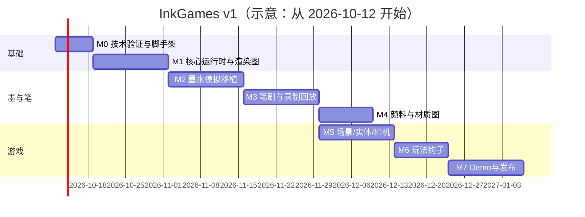

# 05 · v1 实施计划

## 1. v1 定义（一句话）

> **InkGames v0.1.0**：一个基于 p5.js 2.x（instance mode）+ WebGL2 的 TypeScript 引擎包。内核是从 inkwash 移植的 GPU 稳定流体墨水模拟（湿度门控、吸收度颜料、Beer–Lambert），加上自研的笔刷系统（借鉴 inkField 的弹簧笔尖、速度控粗细、飞白、干笔扩散），配套固定步长游戏循环、轻量 ECS、笔画碰撞、2D 相机与视差层、录制回放、调试工具。随附一款可通关的小游戏和 3 个示例场景，桌面和中高端移动端都能跑到 60fps。

## 2. 范围

### 2.1 v1 必做（Must）
- 渲染图 + 质量档 + 浮点格式探测与降级
- 墨水模拟：velocity / pressure / wet / ink / fixed / material；splat（实例化）；干燥与固定；白色
- 纸张：3 种预设（生宣、熟宣、绢）
- 笔刷：6 个预设（湿毛笔、枯笔飞白、勾线细笔、水刷、泼墨、白笔）；压感 / 速度模拟；墨量
- 颜料：8 种（焦墨、浓墨、淡墨、花青、赭石、藤黄、朱砂、胡粉）
- 游戏：固定步长循环、ECS、笔画 → 胶囊链碰撞、简易 2D 物理、触发器、事件、Camera2D、视差层（实时 1 层 + 预烘焙 N 层）
- 场景 JSON / 笔刷 JSON / 录制格式 v1；确定性回放
- 调试：Profiler、BufferViewer、lil-gui 参数、`?demo` 无头测试
- 示例：沙盒、《墨渡》3 关、锦鲤池、远山云雾

### 2.2 v1 可选（Should，有时间就做）
- 环境风场（flowField）对墨与实体施力 —— 计划放在 M6，优先级高
- 异步 GPU 采样 `ink.sample()`
- 自动降档
- InkSprite 晕边动画

### 2.3 v1 不做（Won't → v2+）
spectral 混色、flow 8 种位移后处理、金属/金粉、cellular/resonance 效果、遮罩工具、3D 相机、大世界分块、WebGPU、联网、编辑器 GUI、视频导出、音频引擎、inkField 录制导入器。

## 3. 性能预算

### 3.1 质量档

| 档位 | 目标设备（**需要真机验证**） | 目标 FPS | maxDpr | dye 短边 | sim 短边 | Jacobi 次数 | inkSimEvery | 后处理 |
|---|---|---|---|---|---|---|---|---|
| high | 桌面独显 / Apple Silicon | 60 | 2 | 2048 | 256 | 22 | 1 | 全开 |
| medium | 近两年 iPhone/iPad、中高端安卓 | 60 | 1.5 | 1024 | 256 | 18 | 1 | grain |
| low | 低端安卓 / 旧 iPad | ≥30 | 1 | 512 | 128 | 12 | 2 | 关 |

（high 的 sim 256 / pressure 22 / dye ≤2048 / dpr≤2 直接沿用 inkwash 的常量 `SIM_BASE`、`PRESSURE_ITER`、`DYE_BASE` 和 dpr 上限；medium/low 的数值是我们的估计，标为**待验证**。）

> 【2026-10-08 检索注】没找到能替代这些估计的公开基准。medium/low 面向移动端，已被 [07](./07-microkernel-plugin-plan.md) 移出 v0.1，仍为估计，不作承诺；桌面档按 G1/G4 实测。相关能力事实：32F 混合在 Safari 约 57%，16F 混合与过滤属 WebGL2 核心，见 [docs/11 · R3](../docs/11-references-and-research.md)。

### 3.2 帧预算（60fps = 16.6ms）

| 阶段 | 预算 | 说明 |
|---|---|---|
| 墨水模拟（GPU） | ≤ 5 ms | 大头是 Jacobi；sim 分辨率很低（256²），主要成本在 dye 分辨率的 advectInk / exchange / material |
| composite + post（GPU） | ≤ 3 ms | dirty 时才跑 |
| 实体渲染（GPU） | ≤ 3 ms | InkSprite 批处理 |
| CPU（输入、笔刷、物理、ECS、提交 GL 命令） | ≤ 4 ms | |
| 余量 | ~1.6 ms | 浏览器合成、GC |

### 3.3 显存估算（medium，dye 1024×~1536，sim 256×384）

- RGBA16F 1024×1536 ≈ 12.6MB/张；ink×2 + fixed×2 ≈ 50MB → **超过移动端 64MB 目标**，需要采取以下措施之一：
  1. fixed 层不用 double：exchange 时活动层用 ping-pong，fixed 用"读 fixed + 写临时 → swap"，与 TargetPool 复用临时目标（省约 12MB）；
  2. medium 档 dye 短边降到 768；
  3. fixed 层用 RGBA8 存"已固定的吸收度/4"（固定后精度要求降低）。
  
  M2 实测后决定。sim 场（RG16F/R16F，256×384）总计 < 3MB；material RGBA8×2 ≈ 12.6MB（可以降到 R8 或 sim 分辨率的 2 倍）。
- 纸纹 8-bit 一张；视差层预烘焙纹理按层数计算（建议 ≤ 2 张 1024 宽）。

### 3.4 性能手段清单
dirty composite、uniform 缓存、ping-pong 交换引用、scissor + 实例化 splat、全屏三角形、只用 framebuffer（单 context）、低档隔步模拟、自动降档、纸纹预烘焙、读回只用 PBO + fence 异步方式、禁止每帧分配（对象池）。

## 4. 里程碑（约 14 周，单人全职估算；两人可压缩到约 9 周）

### M0 · 技术验证与脚手架（1 周）
任务：
- pnpm workspace、Vite lib、TS strict、Vitest、Playwright、ESLint/Prettier、CI（GitHub Actions：lint + unit + e2e Chromium）。
- **Spike A**：p5 2.3.x instance mode 下 `createFramebuffer({format: HALF_FLOAT})` 能否作为 RG16F/R16F/RGBA16F 渲染目标；不能的话改用 GLIsland 直接创建原生 FBO。【2026-10-08 已核】不能：p5.Framebuffer 只有 RGB/RGBA 通道，HALF_FLOAT 只能得到 RGBA16F，不支持时静默退回 8-bit（[docs/11 · R2](../docs/11-references-and-research.md)）。
- **Spike B**：在 p5 管线中途用 `drawingContext` 做 MAX 混合 + scissor + 实例化 draw，确认状态恢复后 p5 的绘制不出错。（p5 的 `blendMode(LIGHTEST)` 在 WebGL 下是否对应 `gl.MAX`，**待验证**。）【2026-10-08 已核，p5 v2.3.4 源码】**不完全对应**：`blendEquationSeparate(MAX, FUNC_ADD)` + `blendFuncSeparate(ONE,ONE,ONE,ONE)`，RGB 取 MAX、alpha 相加；p5 还缓存混合状态，原生改动后须恢复。wet 的 MAX splat 用原生 `gl.blendEquation(gl.MAX)`（[docs/11 · R1](../docs/11-references-and-research.md)）。
- **Spike C**：iOS Safari / 安卓 Chrome 上 `EXT_color_buffer_float` / `EXT_color_buffer_half_float` 的可用性；把 inkwash 原版放到手机上测 FPS 作为基线。【2026-10-08 注】移动端已移出 v0.1；参考数据：Web3D Survey 中 iOS 的 `EXT_float_blend` 约 51%，`EXT_color_buffer_float` 约 100%（[docs/11 · R3](../docs/11-references-and-research.md)）。
- 把 inkwash 快照放进 `thirdparty/inkwash/`（含 licence），建立 `THIRD_PARTY_NOTICES.md`。
验收：
- [ ] `pnpm dev` 打开沙盒，p5 instance mode 画出一个 16F framebuffer 往返测试（写入 0.001 增量，读回不丢精度）。
- [ ] 一份 spike 报告（3 台以上设备的格式支持 + inkwash 基线 FPS），确定 "p5 原生 pass" 与 "GL island" 的分工。
- [ ] CI 绿。

### M1 · 核心运行时与渲染图（2 周）
任务：`core/`（Engine、Loop 固定步长、Time、Rng 命名流、Events、Quality）、`gfx/`（RenderTarget、TargetPool、Pass、RenderGraph、ShaderLib + `#include`、uniform 缓存、GLIsland、p5compat）、`debug/Profiler` 初版。
验收：
- [ ] 单测：Loop 在 30/60/144Hz 模拟帧率下 fixedUpdate 次数正确，卡顿时最多 2 步/帧。
- [ ] 单测：Rng 流相互独立（向 A 流多取 1 次，B 流序列不变）。
- [ ] RenderGraph 跑通 3 个 pass 的链（clear → noise → display），double target 交换不拷贝；Profiler 显示每个 pass 的耗时。
- [ ] 两个 InkEngine 实例同页运行互不干扰。

### M2 · 墨水模拟移植 + 合成 + 纸（2 周）
任务：移植 inkwash 的 shader 1–11、15、16、19（见 04 §7）；`ink/InkSim`、`SplatQueue`（实例化）；`paper/` 3 种预设；`composite`（Beer–Lambert、edge、grain、white、wet sheen）；resize 重采样；BufferViewer。
验收：
- [ ] 用相同的脚本化输入，InkGames 的结果与 inkwash 原版**视觉等价**（并排截图，人工评审 + 统计量：平均吸收度、覆盖率误差 < 5%）。
- [ ] `?demo=ink-basic` 在 Playwright Chromium 下输出稳定的统计哈希（同机重复 3 次一致）。
- [ ] high 档桌面墨水模拟 ≤ 5ms；medium 档在至少 1 台 iPhone + 1 台安卓上 ≥ 55fps（空闲 + 持续画）。
- [ ] 显存方案（§3.3）选定并实测 ≤ 64MB（medium）。

### M3 · 笔刷与笔画 + 录制回放（2 周）
任务：`brush/`（TipPhysics spring/exp、PressureModel、BristleMask、InkLoad、taper/explode、6 个预设 JSON）、`inkDiffuse.frag`（干笔扩散）、`input/`（PointerHub、量化到固定步、Recorder/Replay）、`Stroke` 与 `StrokeGeometry`（RDP + 胶囊链）。
验收：
- [ ] 6 个预设各有一张"标准笔画"基准截图（Playwright），由美术/用户评审：湿笔能洇开、枯笔出现飞白断丝、细笔能稳定勾线、水刷能推动已有湿墨、白笔能覆盖干墨。
- [ ] 同一速度下 30fps 和 144fps 画出的笔画几何差异 < 0.5px（固定步长生效）。
- [ ] 录制 → 回放：笔画点、Stroke 几何、墨量 100% 一致（单测）；同机像素统计哈希一致（e2e）。
- [ ] 录制体积：每秒书写 ≤ 3KB（JSON gzip 前）。

### M4 · 颜料、材质图、纸性（1.5 周）
任务：`color/`（Pigment、8 种颜料的吸收度调参、Palette）、`advectMaterial.frag` + MaterialMap API、纸 `absorbency/sizing` 对湿度扩散和边缘的调制、选色器工具（RGB → absorbance，参考 inkwash 1033–1042）。
验收：
- [ ] 墨分五色：同一墨在 5 档水量下得到明显可区分的 5 级浓淡（亮度差值单调，色板截图评审）。
- [ ] 两种颜料叠加呈现减色效果（花青 + 藤黄 → 偏绿），不变灰、不出现负值或 NaN。
- [ ] MaterialMap 在平流 600 步后，身份边界不出现插值造成的错误 ID（单元测试检查：只出现合法 ID）。
- [ ] 生宣与熟宣的同一笔画扩散半径差 ≥ 30%。

### M5 · 场景、实体、相机、资源（2 周）
任务：`scene/`（World、Entity、Component、System、Prefab、SceneDef 加载与校验，用 JSON Schema 或 zod）、`camera/`（Camera2D、ParallaxLayers）、`assets/`（Loader）、`InkSprite` 组件与 `inkSprite.frag`、`tools/bake-layer`（离线烘焙视差层）。
验收：
- [ ] 通过 JSON 加载一个包含 50 个实体、2 层视差、预画笔画（prestrokes）的场景，200ms 内完成（桌面）。
- [ ] 相机跟随、缩放时墨水场与实体对齐误差 < 1px；视差层按系数移动。
- [ ] 1000 个 InkSprite 实体在 high 档 ≥ 60fps。
- [ ] SceneDef 校验失败时给出带路径的错误信息。

### M6 · 玩法钩子（1.5 周）
任务：`physics/`（圆、AABB、胶囊链、broadphase 网格、重力、反弹、触发器）、`StrokeColliderSystem`（笔画松开或干燥后生成碰撞体）、墨量预算、`flowField.frag` + `setWind` + `FieldProbe`（实体受风/水流影响；速度场读回用低分辨率异步方式，或者用 CPU 侧的同一份解析噪声函数，保证确定性）、音频钩子、`reduce.frag`（覆盖率统计）。
验收：
- [ ] 球在笔画上滚动、反弹，确定性回放 100% 一致。
- [ ] 墨量用完后不能继续画，UI 事件正确触发。
- [ ] 风场同时影响墨（GPU）和实体（CPU 解析版），两者方向一致（目测 + 单测比较采样值）。
- [ ] 音频钩子示例：笔速 → 音量的 demo。

### M7 · Demo、示例、移动端调优、文档、发布（2 周）
任务：《墨渡》3 关、沙盒完善、锦鲤池、远山云雾；移动端真机调优与自动降档；文档（快速开始、API 参考由 TypeDoc 生成、笔刷/场景 JSON 说明）；`THIRD_PARTY_NOTICES.md` 定稿；v0.1.0 tag。
验收：
- [ ] 《墨渡》3 关可以从头玩到通关；所有关卡有回放录制并通过 e2e。
- [ ] medium 档在目标手机上 60fps（持续 5 分钟不掉到 50 以下，无明显发热降频）；low 档 ≥ 30fps。
- [ ] 引擎包 gzip 后 < 150KB（不含 p5）。
- [ ] 文档：从零开始 15 分钟内能跑起第一个"画笔画 → 球滚动"的例子（找 1 人试用）。
- [ ] 许可证审查清单全部打勾（§7）。

（M4 与 M5 可以由两人并行；单人则顺序执行，总长约 14 周。）

## 5. Demo 游戏与示例场景

### 5.1 示范游戏《墨渡 InkCross》（提案）
- **玩法**：每关有一颗"墨珠"从山顶落下，目标是让它滚到落款印章处。玩家用有限的墨量画笔画，**笔画干了以后变成实体**（湿的时候墨珠会穿过并被染色/减速）。水刷可以把还没干的笔画冲开、改形状；风场会把湿墨吹歪。
- **验证的引擎能力**：笔刷手感、干湿状态 → 碰撞（`solidifyAfter: 'dry'`）、墨量资源、物理与确定性回放、风场、视差背景、移动端触控/压感。
- **3 关**：①教学（直线搭桥）；②风（湿墨被吹偏，必须等干或者顺风画）；③水（关卡里预先有湿墨区，可以借水刷改道）。
- **美术**：全部由引擎实时生成（墨珠 = InkSprite，印章 = 朱砂颜料 sprite），远山用 `bake-layer` 离线烘焙。

### 5.2 示例场景
1. **sandbox（墨戏台）**：全部笔刷、颜料、纸张、参数面板、录制/回放/导出 PNG、BufferViewer。用作引擎的"回归画板"。
2. **koi-pond（锦鲤池）**：水刷在池中搅动，速度场（通过 FieldProbe）推动用 InkSprite 渲染的锦鲤；滴墨会在水中晕开。展示流体与实体的耦合。
3. **mountain-mist（远山云雾）**：3 层预烘焙山水视差 + 实时云雾（低浓度淡墨 + 风场），相机缓慢平移。展示视差层与离线烘焙管线（**不使用** inkField `lib/mountain-mist.json` 录制，只是同类题材）。

## 6. 风险与对策

| # | 风险 | 可能性 | 影响 | 对策 |
|---|---|---|---|---|
| 1 | **许可**：误用 inkField 代码 / shader / 参数表 | 中 | 高 | clean-room 规则：实现者不打开 `script.js`/`shader.js` 写代码，只依据本计划 01 的思想描述和公开文档；PR 模板勾选"无 inkField 代码"；`thirdparty/` 不放 inkField 构建产物；有需要时向作者申请授权 |
| 2 | p5 2.x 渲染状态与原生 GL 调用冲突、版本变动 | 中 | 中 | GLIsland 统一保存/恢复状态；锁定 p5 小版本；`p5compat` 适配；M0 Spike B |
| 3 | 移动端不支持渲染到半浮点纹理 | 中 | 高 | M0 Spike C；降级路径：RGBA8 打包（吸收度做对数编码）+ 更少迭代；最坏情况下 low 档关闭流体，只保留"干笔扩散"模式 |
| 4 | 显存超标（双缓冲 16F） | 中 | 中 | §3.3 的三种方案；TargetPool 复用 |
| 5 | 跨 GPU 不确定 | 高 | 中 | 游戏判定只依赖 CPU 几何；GPU 结果录制；回放基准按"设备 + 档位"保存 |
| 6 | Safari WebGL context 数量限制、性能差异 | 中 | 中 | 单 context、全部 framebuffer（inkField 的经验）；WebKit 进 e2e |
| 7 | Jacobi 压力迭代成本 | 低 | 中 | 分档迭代数；必要时改用 multigrid 或减少迭代 + 涡量补偿 |
| 8 | **美术方向**：模拟太像"水彩"，不像"水墨" | 高 | 高 | 早期（M2 末、M3 末）安排美术评审；飞白鬃毛、干笔扩散、纸 absorbency、墨分五色曲线作为调参重点；收集参考画作（八大山人、齐白石、黄宾虹的墨法）建立对照板 |
| 9 | 无头 CI 没有真实 GPU，截图测试不稳定 | 高 | 低 | 统计量 + 容差比较，而不是逐像素比较；真机测试清单手动执行 |
| 10 | 范围蔓延（想把 inkField 的全部效果都做进来） | 高 | 中 | 严格按 §2.3 的 Won't 列表执行；新效果进 v2 backlog |
| 11 | p5 LGPL-2.1 的分发义务 | 低 | 中 | p5 作为未修改的 npm 依赖、单独的 chunk 分发，并在 NOTICES 中说明来源与许可；不修改 p5 源码 |

## 7. 许可与合规要点

1. **inkField**：Open Creative License，源码"closed until maintenance dormancy"，明确保留"把渲染引擎集成进其他应用、构建衍生代码库"的权利。→ InkGames **不包含**其任何代码、GLSL、常量表、色表、录制文件；只按公开文档与本分析描述的**思想**独立实现，并在相关源码文件头注明"concept inspired by inkField (ideas only, no code)"。是否需要作者授权、是否构成衍生，需要法律意见；如果想更直接地参考，应联系作者（ileivoivm@gmail.com）取得书面许可。**本计划不构成法律意见。**
2. **inkwash**：MIT，© 2026 Jonathan Whitaker → 可以移植；移植的文件头保留来源与版权，`THIRD_PARTY_NOTICES.md` 收录 MIT 全文，`thirdparty/inkwash/` 保留原始快照与 `licence.txt`。
3. **p5.js**：LGPL-2.1 → 作为不修改的外部依赖；如果打包进 bundle，单独 chunk，NOTICES 写明来源与获取源码的方式。
4. **p5.easycam**（v1 不用）：inkField LICENSE 写 LGPL，文件头写 MIT（© 2018 Thomas Diewald）——如果 v2 要用，以上游仓库 `diwi/p5.EasyCam` 的许可为准。
5. **spectral.js**（v2）：MIT。**simplex noise**：用 Ashima/stegu webgl-noise（MIT）并保留声明。**lil-gui**：MIT。
6. InkGames 本身建议 MIT（与 inkwash 一致，方便社区使用）——待用户确认。
7. 合规检查清单（v0.1.0 前）：[ ] NOTICES 完整；[ ] 代码扫描中没有 inkField 特征字符串（例如 `newBufferBlack`、`typeMapBuffer`、`_j`/`_x` 混淆名、35 色表数值）；[ ] 所有 assets 有许可来源；[ ] 示例中没有第三方录制作品。

## 8. 待决问题（需要用户拍板）

1. 平台优先级与最低设备（决定 medium/low 档的具体数值）。
2. 《墨渡》玩法是否认可，或者换成其他类型（书法解谜、以墨御敌、禅意沙盒）。
3. 是否需要横向卷轴 / 大世界（v1 默认单个"画布世界"）。
4. TypeScript + Vite + pnpm 工具链是否可接受。
5. 是否联系 inkField 作者；InkGames 自身的许可（建议 MIT）。
6. `thirdparty/` 现有内容（本计划没有核实），是否同意按 04 §6 的规则整理。
7. 美术评审由谁负责；是否有指定的参考画作和纸张扫描素材。

## 9. 下一步（批准计划后第一周）

1. 按 04 §6 建立仓库骨架与 CI（M0）。
2. 执行 Spike A/B/C，输出报告，修订 §3 的质量档数值。
3. 搭建 inkwash 移植的对照测试页（原版 vs InkGames 并排）。
