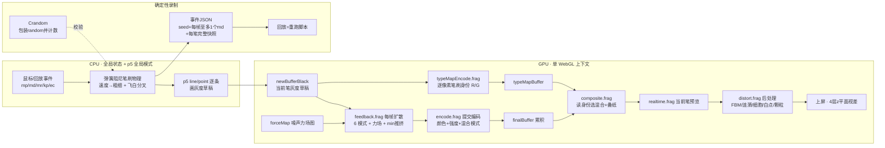
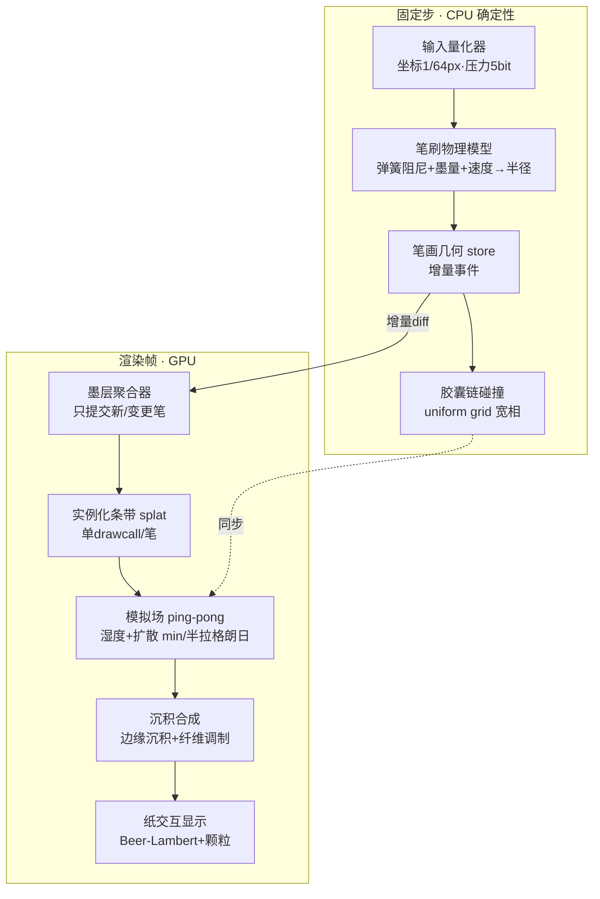

# 08 · 基于 inkField 逆向的 src 优化计划

> 生成日期：2026-10-08。前置：[01 inkField 参考](./01-reference-analysis-inkField.md)、[07 实施基线](./07-microkernel-plugin-plan.md)。
> 本文档是**优化计划**（问题 → 方案 → 验收），不是新功能路线图；《墨渡》页面与端到端测试仍按 07 执行。
> 许可红线不变：inkField 只借思想，不拷代码/shader/常量表；下列所有方案均为 clean-room 设计。

## 0. inkField 架构复盘（逆向结论）



**与 InkGames 现状的本质差异**：

| 维度 | inkField（成熟应用） | InkGames src（当前） | 差距 |
|---|---|---|---|
| 墨迹质感 | 灰度草稿+6模扩散+边缘沉积+编码合成，深浅层次丰富 | R16F 单通道 splat + 基础湿迁移，渲染为固定纸色指数衰减 | **大**（视觉核心） |
| 墨迹扩散 | 白底灰墨以 `min(原, 偏移)` 深色优先，可能扩大暗区 | 光学密度场半拉格朗日 advection 会数值耗散，不保证质量守恒 | 中 |
| 笔刷手感 | 弹簧阻尼+速度控制粗细+鬃毛分叉飞白+压感升档 | 审计时输入点直接连线段、半径=默认×压力；目前已增加笔尖跟随，但飞白未完成 | **大** |
| 每帧扩散的确定性 | 逐帧扩散依赖固定帧率，回放靠"每帧≤1事件"锁步 | 固定步长已就位，但流体 sim 分辨率独立、无跨机哈希 | 小 |
| 身份/材质管理 | 独立 typeMap，位移时双 pass 同步、最近邻保身份 | 无身份通道（单色原型） | 中 |
| 状态合成 | dirty flag + uniform 缓存 + 指针级省拷贝意识 | `ink-fluid` 每笔触发**全量重建**（清空+重画所有笔） | **大**（性能） |
| 录制格式 | 事件流+笔快照+seed，30 万字节/幅 | 消息日志，含引擎内部分度值 | 小（够用但松） |
| 资源边界 | 引擎与 UI 无边界（反面教材） | 微内核+插件+依赖图（正确） | 已领先 |
| GL 共存 | 单 context、createFramebuffer 共享 | withGLState 快照恢复（正确但每 pass 都做全套） | 已领先，可省 |

**最重要的三条借鉴**（其余见 §3–§6）：
1. **"草稿-编码-合成"三段式**：墨的层次来自"灰度草稿自由扩散 → 提交时按强度编码 → 合成时按身份混合"，而非单通道直接显示。
2. **浓度场与灰度场必须区分**：inkField 的 `min()` 在白底灰度上扩张暗区，不能直接用于光学密度场，也不保证质量守恒。
3. **确定性 = 输入量化 + 每步一事件 + 有限随机预算**：inkField 用"每帧≤1 md 事件"锁步；我们已有固定步长，补齐量化与预算即可超越。

---

## 1. src 现状审计（问题清单，按严重度排序）

审计范围：`src/core/*`、`src/plugins/*`（2026-10-08，构建通过、30 测试通过）。

### P0 — 正确性/性能硬伤

| # | 问题 | 位置 | 详情 |
|---|---|---|---|
| A1 | **流体全量重建** | `ink-fluid-plugin.ts:32-34` + `ink-fluid.ts:187` | 任何 `StrokeCreated/Changed/Cleared` 事件 → `rebuild()` 清空 pigment/wet 两张全分辨率纹理并**重画历史所有笔**。水刷擦除每秒触发多次事件时，帧成本 = O(全屏×2次clear + 全部历史笔splat)。这是当前最大的性能悬崖，也使"湿迁移"的连续演化被反复打断（视觉上扩散重启）。 |
| A2 | **CPU 逐点 splat 循环** | `ink-fluid.ts:175-185`、`ink-webgl2.ts:135-140` | 每条线段按 `ceil(distance/radius)` 上限 1000（或 2048）次逐点 `stamp()`，每次一个 drawcall。一次拖拽 = 数千 drawcall × 全屏 fragment。正确方向是**单 drawcall 实例化条带**（一次上传所有 stamp 的参数，一个三角形实例 = 一个 splat）。 |
| A3 | **指针笔迹未完成权威量化** | `world.ts:61`、`geometry.ts:44` | 审计时 DOM 压力直接进半径；目前已在 stroke fixed step 量化输入并平滑半径，但直接 `DrawStroke` 与录制回放的原始 pointer 样本仍未统一量化。 |
| A4 | **GL 状态查询待测** | `gl-state.ts`、`ink-fluid.ts:step/render` | 守卫按一次 `step` 和一次 `render` 执行，并非每个 pass 都快照；仍须在真实 GPU 上插桩，只有确认是瓶颈后再优化，不能跨插件延迟恢复。 |

### P1 — 视觉/手感差距（对标 inkField 质感）

| # | 问题 | 位置 | 详情 |
|---|---|---|---|
| B1 | **无笔刷物理** | `geometry.ts:37-49` | 输入点直通。缺：弹簧阻尼跟随、速度→粗细（提按）、飞白（速度超阈值时鬃毛遮罩）、墨量随笔画衰减。inkField 的书法手感全部源于这三件事的叠加（01§6）。 |
| B2 | **湿迁移仅 4 邻域模糊** | `ink-fluid.ts:40-50` | pigment/wet 只有单像素 4 邻域扩散，无：边缘沉积（干边变深）、纸纤维方向各向异性、墨浓度驱动的渗透速度差。墨迹看起来是"模糊"而不是"洇"。 |
| B3 | **纸性尚不完整** | `ink-fluid.ts:51-57` | 审计时 display 已有 `exp(-ink)` 光学密度近似及纸面颗粒、absorbency 已调制扩散；现已补纤维调制迁移和湿边显示，仍缺固定层与可校准沉积。 |
| B4 | **擦除是全量重建** | `ink-fluid.ts:186` | 水刷擦除后湿墨演化被硬重置，丢失"擦除后残留湿度继续洇"的自然过渡。正确做法：几何擦除（已有）+ GPU 局部清除纹理（scissor 到包围盒），保留周围湿度场。 |

### P2 — 架构/健壮性

| # | 问题 | 位置 | 详情 |
|---|---|---|---|
| C1 | **物理碰撞 O(N×M) 全量扫描** | `physics.ts:41-62` | 每球×每线段，无空间划分、无宽相剔除。墨迹多时帧成本线性恶化。短期加 uniform grid；长期按 07 的固定步碰撞演进。 |
| C2 | **录制 payload 含运行时对象** | `recording.ts:16` | `JSON.stringify` 深拷贝每条消息；`DrawStroke` 的 points 数组被两次结构拷贝。消息风暴时（快速绘制）GC 压力大。方案：录制器改为对已知 kind 声明序列化器（浅拷贝+定长数值量化）。 |
| C3 | **`inkcross` 墨量按欧氏长度** | `inkcross.ts:24-27` | 与视觉墨迹无关的长度计费，鼓励"快速甩线"漏洞；且循环里 `hypot` 每段调用。改为按"理论墨量 = Σ(面积×浓度)"预算，与 B1 的墨量消耗共用同一模型。 |
| C4 | **场景 strokes 无上限累积** | `geometry.ts` store | 无条数/顶点上限（scene-json 只限加载时 500 条）。长时间游玩内存与 A1 的 rebuild 成本都无限增长。 |
| C5 | **resize 不支持** | `ink-fluid.ts:219-221` | 直接 throw。窗口缩放/全屏场景必崩。需要：模拟场保持 sim 分辨率、染料场用 blit 重分配。 |

---

## 2. 目标架构（src 演进后的样子）



关键不变式（必须写进测试）：
- **I1**：权威碰撞几何 = `Stroke.fragments`（水刷改变它即改变物理世界），渲染层只读。
- **I2**：模拟场步进次数只由引擎 step 决定（`render()` 内按 `ctx.step` 补齐），渲染帧率不影响模拟；GPU 图像跨驱动逐像素一致仍未验证。
- **I3**：同一录制回放 → 每 N 步几何哈希一致（量化坐标 + 四则/sqrt only）。
- **I4**：增墨和擦除分别记账；无输入期间允许数值耗散，禁止出现明显的凭空增墨。`min()` 在浓度表示下不保证质量守恒；GPU 数值误差与表现须实测。

---

## 3. 优化方案（P0/P1 逐条）

### 3.1 A1+A4：安全增量提交与 GL 状态边界

**方案**：`StrokeCreated` 按 ID 去重后只提交新笔；`StrokeChanged` 暂使用全量重建确保重叠笔和湿墨不被局部清除误删，后续先建立静态笔层/动态湿层与笔画覆盖索引，再实现受影响区域重绘。`StrokeCleared` 清空所有字段。`withGLState` 维持公开边界，仅缓存每个程序的 uniform location；若插桩显示状态查询是瓶颈，再把整次 `step()`/`render()` 包为单一守卫，不得跨插件 renderPhase 延迟恢复。

**验收**：100 笔场景追加第 101 笔只提交该笔；交叉笔水刷后保留未擦除线段；统计每帧 GL drawcall、状态查询与耗时，先记录基线，再设性能门槛。

### 3.2 A2：安全批量 splat

**方案**：新 `stroke-splat.ts` 可用 instanced quad + `gl.BLEND` 在 R16F 上执行加法混合（需运行时验证 EXT_float_blend/半浮点混合）或按小批次分组输出覆盖场；禁止同一 drawcall 一边采样旧纹理一边写同一纹理，亦不能假定重叠实例的混合结果等于逐次 ping-pong。若扩展不可用，保留现有 ping-pong 路径并用 scissor 将全屏 fragment 工作量限制在笔尖区域。湿场取最大值须独立混合策略（不能与 pigment 加法混同）。

**验收**：单笔 500 点记录 drawcall、帧时间、重叠墨浓度与湿度；只有运行时通过 GL 扩展与图像回归时才启用 instancing，不承诺未经验证的 drawcall 数。

### 3.3 A3：输入量化与笔刷物理（同时解决 B1）

**方案**：新增 `brush-model.ts`（纯函数、无 GL）：
```ts
interface BrushState { x,y,vx,vy, inkLeft, lastRadius }
function brushStep(s: BrushState, target: QuantizedSample, paper: PaperParams, dt: fixedDt): BrushState
```
- 输入量化：坐标 `Math.round(x*64)/64`、压力 `Math.round(p*31)/31`（录制/回放共享同一量化器，I3 的基础）。
- 弹簧阻尼：固定步中用预先确定的阻尼系数 `v = (v + (target-pos)*spring)*damping`，权威几何不得使用 `Math.pow`；速度映射半径，墨量按步扣除，墨尽后视觉飞白与碰撞几何保持一致。
- 飞白：半径小于阈值或速度超阈值时，splat 改为鬃毛遮罩模式（GPU 端 hash 阈值剔除实例），思想来自 inkField 分叉但不抄偏移表。
- 输出 `StrokePoint[]` 进 store —— 几何层完全不变，`geometry.ts` 只是把"原始采样"换成"笔刷物理输出"。

**验收**：同录制回放哈希一致（I3 测试）；快速甩笔出现飞白、慢速饱满；压力抖动消除（相邻点半径变化 < 15%）。

### 3.4 B2+B3：纸性扩散与沉积合成

**方案**（分两个里程碑落地，均只动 shader 常量级结构，不动 JS 架构）：
- **M-扩散**：`pigment` shader 加入纸纤维各向异性扩散与边缘沉积；采用质量有界的邻域迁移，不把 `min()` 当守恒证明。干性视觉扩散可另设独立 pass，并对 GPU 增墨误差设基线。
- **M-沉积显示**：现有 `display` 已有 `exp(-ink)` 近似光学密度；扩展为可校准的湿/干浓度及边缘沉积，并让纤维纹理影响吸收而非仅影响纸色。
- 湿度场已就位（`wet` pair），此阶段把它从"迁移门控"升级为"σ 调制 + 干燥固化"：`dry` 累积通道（RG16F：R=湿、G=已固化墨），湿墨可再迁移、固化墨不再动 —— 这正是 inkField "提交后 finalBuffer 不再扩散"思想的场化版本。

**验收**：静止 10 秒后墨迹边缘出现深色沉积环；`paper.absorbency` 滑块视觉可辨；I4 对账（ pigment 总和 ±1% 内单调）。

### 3.5 B4：局部擦除

**方案**：先保留全量重建确保重叠笔正确；要实现真正局部擦除，必须分离静态墨层与动态湿层，维护包围盒与受影响笔索引，清理的区域重绘所有相交笔而非仅当前笔。擦除后的残湿是否保留必须作为水刷规则显式定义并验证。

**验收**：连续水刷 60 秒无帧率劣化（对比 A1 基线）；擦除区域再落笔时扩散半径 > 干纸区域。

### 3.6 P2 清单（一并做，改动小）

| 项 | 方案 |
|---|---|
| C1 | `physics.ts` 加 uniform grid（cell = 8×最大胶囊半径），球只查所在 cell 及邻域；确定性要求 cell 划分用量化坐标。 |
| C2 | `recording.ts`：`RecordedPayload` 联合类型 + 按 kind 注册的 `serialize`，录制路径零 `JSON.stringify`；回放侧 `deserialize` 对称。 |
| C3 | `inkcross` 墨量 = 笔刷物理输出的 `inkUsed`（B1 共用），扣费发生在 brushStep 而非事后测量。 |
| C4 | store 加 `maxStrokes`（默认 1024，超限拒绝并 emit `InkBudgetExhausted`）。 |
| C5 | `InkFluid.resize`：分配新场 → blit 旧场 → 删除旧场；模拟场保持 sim 网格尺寸不变只改采样映射。 |

---

## 4. 里程碑排期（建议 4 个 PR 粒度）

| 阶段 | 内容 | 依赖 | 规模估计 |
|---|---|---|---|
| **O1 增量与状态栈** | A1+A4（3.1）+ C5 | 无 | ~2 天；`ink-fluid-plugin`、`gl-state`、`ink-fluid` |
| **O2 笔刷物理与量化** | A3+B1+C3（3.3） | O1（增量接口） | ~3 天；新 `brush-model.ts` + `world/geometry` 接线 |
| **O3 实例化 splat** | A2（3.2） | O1 | ~2 天；新 `stroke-splat.ts` |
| **O4 纸性与沉积** | B2+B3+B4（3.4/3.5） | O3 | ~4 天；shader 为主 |
| （并行）P2 | C1/C2/C4 | 无 | 各 ~0.5 天 |

每阶段验收后跑：`./build.sh check` + `./build.sh browser` + 桌面真实 GPU 手绘冒烟（`apps/inkcross`）；`check` 已包含测试。浏览器无头 SwiftShader 不能代替真实 GPU 性能验收。

### 4.1 当前执行状态（2026-10-08）

- [~] O1：新增笔画按 ID 增量提交；侵蚀/清空仍全量安全重建。`InkFluid.resize` 现复制 wet/pigment/fixed 双缓冲（未做缩放交互回归）；局部脏区、GPU 基准与状态查询插桩未完成。
- [~] O2：指针坐标/压力量化、弹簧阻尼、速度收细、墨量递减与基础视觉飞白已接线；`PointerSample` 命令可录制并有单测。仍缺跨浏览器哈希与真实画笔手感评审。
- [~] O3：`EXT_float_blend` 可用时对 pigment 用 ADD、wet 用 MAX 实例化绘制，每笔两次 draw；不可用则回退逐点 ping-pong。SwiftShader 鼠标绘制后 GL 无错误且像素变暗；尚无重叠混合图像回归、真实 GPU 实测及绘制耗时基线。
- [~] O4：纸纤维调制迁移、边缘显示、独立固定墨层与湿度驱动的固化交换已实现；墨量数值对账、重叠笔安全局部擦除仍缺。全量重建会丢失历史湿墨演化。
- [~] P2：空间网格宽阶段与运行时笔画/点数上限完成；墨渡扣费改为宽度加权长度。录制深拷贝换 `structuredClone`，按 `source: 'pointer'` 跳过派生绘画命令。仍缺录制场景快照、复杂命令序列化契约与真实 GPU resize 验证。

以上性能与美术结论均未经过真实 GPU/跨浏览器实测，禁止视为阶段验收通过。

## 5. 不做的事（明确出界）

- 不引入 inkField 的颜色编码/typeMap（我们是单色墨 v0.1；彩色进 v2 时直接用独立身份纹理思想即可，不复用其 GLSL）。
- 不做 flow 后处理 8 种 blendType、虫咬、金属 —— 属于 v2+ 特效层。
- 不把 p5 framebuffer 换回 createGraphics 多 context（那是 inkField 已纠正过的弯路）。
- 不改 `core/` 内核调度语义（现有固定步 + 命令/事件队列正是 inkField 用"每帧一事件"换来的东西的严格超集）。

## 6. 风险

| 风险 | 缓解 |
|---|---|
| 实例化 splat 在 Safari 的 `drawArraysInstanced` 半浮点属性兼容 | O3 先做 4×4 矩阵手动展开 fallback；G1 平台断言补一项 |
| 鬃毛遮罩 hash 在不同 GPU 结果不一致 | 遮罩只影响视觉不影响几何，录制回放哈希只校验几何与墨量对账 |
| 增量渲染与"湿演化被事件打断"的回归 | O1 附带录制回放对比测试（同输入 → 每 60 步 pigment 总和差 < 0.5%） |
| 笔刷物理引入后《墨渡》手感突变 | O2 落地时同步调墨渡关卡参数，并在 apps 里保留旧手感开关一个版本 |
